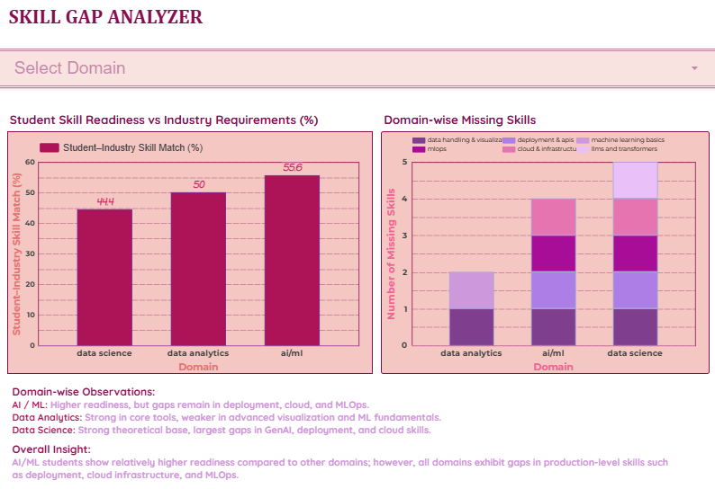

# Skill Gap Analyzer

## Overview
Skill Gap Analyzer is a data-driven analytics project that compares student skills with industry job requirements to identify skill gaps across different domains. The project aims to improve career readiness by providing clear, data-backed insights.

## Problem Statement
Students often learn multiple skills without clarity on which skills are actually required for real job roles. Rapidly changing industry requirements and generic learning paths lead to a mismatch between student skills and employer expectations.

## Solution
This project analyzes student skill survey data and job skill requirements to calculate a skill match percentage for each domain. The analysis highlights missing or weak skills, helping users understand where improvement is needed.

## Tech Stack
- Google Forms – Student skill data collection  
- Google Sheets – Data storage and preprocessing  
- SQL – Skill gap and skill match percentage analysis  
- Looker Studio – Data visualization  

## Project Structure
skill-gap-analyzer/
├── data/
│ ├── job_skill_requirements_raw.csv
│ └── student_skill_survey_raw.csv
├── sql/
│ └── skill_match_percentage.sql
├── screenshot/
│ └── dashboard_overview.png
├── README.md
└── LICENSE

## Key Feature
- Calculates skill match percentage by comparing student skills with job role requirements

## MVP
The Minimum Viable Product (MVP) is implemented as a Looker Studio dashboard.  
For this repository, the MVP is demonstrated through dashboard screenshots.

## Dashboard Preview
Below is a preview of the Skill Gap Analyzer dashboard showing skill match percentages and missing skills across domains.

## Future Scope
- AI-based personalized skill recommendations  
- Resume-to-job role matching using NLP  
- Predictive analysis of in-demand skills  
- Institution-level dashboards for student readiness tracking  

## License
This project is licensed under the MIT License.
